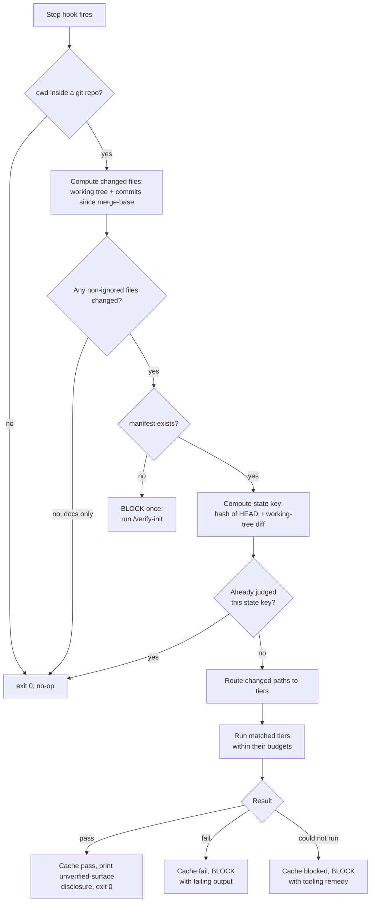

# Cross-Repo `verify` Standard — Design

**Date:** 2026-09-08
**Status:** Approved design, pending implementation plan
**Scope:** All SnowForge repos (12), plus the headless autobuild loop

## 1. Problem

Every SnowForge app has a different definition of "it works," and none of them are
enforced. The result is a recurring, documented failure shape: a change ships with a green
build and is discovered broken later, in production.

Three instances from `C:\Users\alexi\.claude\TODO.md`, all SnowPipe, all within six weeks:

- **#82** — `exportFilters` was silently ignored on *every* code path. The UI persisted a
  bare-array shape, the engine expected a wrapped object, and chunk-mode had no filter
  logic at all. Typecheck, lint, and build were green throughout. Found only when a real
  filtered job ran and the row counts were wrong.
- **#52** — the v1beta to v1 Merchant API migration left the payload on the old shape. The
  build proved nothing; a real export against Google did.
- **#83** — the production Lambda crashed at cold start for roughly three hours on a
  CJS/ESM mismatch introduced by a transitive AWS SDK bump. No local check covered it.

The common factor is that "verified" meant "compiles" instead of "was observed doing the
thing." The fix is to make runtime proof a precondition of finishing, and to make the
*kind* of proof depend on what changed.

A second, compounding problem is drift. Twelve repos each maintaining their own
verification logic is the same drift the autobuild loop already exists to reconcile
between `PROGRESS.md` and reality. The standard must centralize logic and distribute only
facts.

## 2. Decisions Taken

| Decision | Choice | Rationale |
|---|---|---|
| Structure | Global dispatcher + thin per-repo manifest | Logic in one file; facts per repo. Minimal drift surface across 12 repos. |
| Enforcement | Blocking Claude Code `Stop` hook | A skill can be rationalized away; a hook cannot. That is the specific failure that let #82 ship. |
| OnDeck native iOS | Expo web is the automated proxy | No iOS simulator on Windows 11 and no Mac. Web is the only automatable UI surface. |
| Honesty requirement | Every pass names what it did *not* cover | Prevents an Expo-web pass from reading as a native pass. |
| New repos | Fail loud, not silent | An unregistered repo blocks once with onboarding instructions rather than no-opping forever. |
| Browser tier cadence | Every qualifying stop | Confirmed 2026-09-08. Pre-push is cheaper but lets a broken UI change sit unverified for a whole session. The wall-clock cost is accepted; the `ignore` globs and path routing are what keep it from becoming a tax. |

## 3. Architecture

### Components

1. **`Stop` hook** — one entry in `C:\Users\alexi\.claude\settings.json`. Fires on every
   session stop, in every directory.
2. **Dispatcher** — `C:\Users\alexi\Documents\Diaz\Repositories\SnowForgeLLC\snowforge-verify`,
   published as `@snowforge/verify`. All logic lives here: repo detection, change-set
   computation, tier routing, budget enforcement, result caching, output formatting. It is a
   tracked repo rather than a loose script in `~\.claude\scripts\`, because §11 requires
   tests written first and an untracked directory cannot hold them. It follows the existing
   `snowforge-notify` convention for standalone `@snowforge/*` packages.
3. **Per-repo manifest** — `{repo}\.claude\verify.json`. Declares surfaces, the command per
   surface, and what each surface cannot prove. Tracked in git.
4. **Onboarding skill** — `/verify-init`. Infers a starting manifest from `package.json`
   and the repo layout, then writes it for review.
5. **Result cache** — `C:\Users\alexi\.claude\verify-cache\{session_id}.json`. Loop
   protection and re-run avoidance.

### Flow



### Why the state key exists

The `Stop` hook input carries `session_id`, `prompt_id`, `transcript_path`, `cwd`,
`permission_mode`, `effort.level`, `hook_event_name`, `last_assistant_message`, and
`turn_count`. It does **not** carry `stop_hook_active`, so the dispatcher cannot detect
that it is already inside a blocked-stop continuation and would otherwise block forever.

The state key solves this. It is a hash of `git rev-parse HEAD` plus a hash of the working
tree diff. The dispatcher records a verdict per state key per session:

- Same key already judged → exit 0 regardless of the verdict. One block per distinct code
  state, never two.
- Claude edits code in response to a block → the diff changes → new key → verification runs
  again.
- Claude argues instead of editing → same key → the hook stops blocking and the session
  ends, with the failure recorded rather than silently dropped.

## 4. Manifest Schema

`{repo}\.claude\verify.json`:

```jsonc
{
  "$schema": "https://snowforge.dev/schemas/verify-1.json",
  "repo": "OnDeck",
  "surfaces": {
    "apps/api/**":    { "tier": "fast",    "run": "pnpm --filter @ondeck/api test" },
    "apps/worker/**": { "tier": "fast",    "run": "pnpm --filter @ondeck/worker test" },
    "apps/mobile/**": { "tier": "browser", "run": "pnpm verify:web" },
    "packages/db/**": { "tier": "full",    "run": "pnpm db:verify" }
  },
  "always": "pnpm typecheck",
  "unverified": {
    "apps/mobile/**": [
      "expo-share-extension (native target, no web equivalent)",
      "expo-secure-store (web falls back to localStorage, different semantics)",
      "the shipped EAS build itself, TestFlight only"
    ]
  },
  "budgets": { "fast": 120, "browser": 360, "full": 900 },
  "ignore": ["**/*.md", "docs/**", "logs/**", "*.png"]
}
```

**Field semantics:**

- `surfaces` — glob to `{tier, run}`. Every matched surface contributes its `run` to the
  run set; the reported tier is the highest matched, ordered
  `skip < fast < browser < full`. Globs match repo-relative POSIX paths.
- `always` — runs whenever any non-ignored file changed, regardless of tier. A cheap floor.
  It holds a command string, not a command list, precisely so a repo that already has a
  gate script can point at it (`"always": "pnpm gate"`) rather than restating its contents
  and creating a second source of truth. SnowFort uses this form.
- `unverified` — glob to a list of plain-English statements. Printed on every pass whose run
  set touched that glob. This is the honesty mechanism, and is **required** for any surface
  whose `run` is a proxy for the real shipped artifact.
- `budgets` — per-tier seconds. Exceeding one is a `blocked` result, never a pass.
- `ignore` — never triggers verification. Docs-only sessions cost nothing.

## 5. Tier Model and Routing

| Tier | Budget | What it proves | Typical cost |
|---|---|---|---|
| `skip` | — | Nothing ran; nothing needed to. | 0s |
| `fast` | 120s | Unit and integration tests, typecheck. Logic is self-consistent. | seconds |
| `browser` | 360s | A real client drove a real running app and observed the result. | 1–5 min |
| `full` | 900s | Device, migration, or external-service level proof. **Never hook-invoked.** | minutes |

**The `full` tier is deliberately outside the hook.** The `Stop` hook's own timeout defaults
to 600s, and a timed-out Stop hook does not block — it would fail open, which is the one
outcome this design must never produce. So the hook runs at most `always` + `fast` +
`browser`, whose budgets sum to 480s and leave headroom under the 600s ceiling. `full` is
invoked manually or from the pre-push path, where nothing is racing a harness timeout.

Routing is by changed path, which is what makes the browser step automatic rather than
remembered. A docs edit runs nothing. An `apps/api/**` edit runs seconds of tests. An
`apps/web/**` or `apps/mobile/**` edit forces a browser run before the session can end.

Applied to #82: the change touched the export filter path, which routes to `browser`/`full`
on SnowPipe, whose run asserts written and rejected row counts against expectation. A
silently-ignored filter fails that assertion. The green build never gets the chance to lie.

## 6. Per-Repo Surface Matrix

| Repo | Shipped surface | `fast` | `browser` | `full` | Notes |
|---|---|---|---|---|---|
| SnowPipe | Next.js web | vitest | Playwright (configured) | real filtered sync, count assertions | Playwright already present |
| TrueIce | web | — | Playwright (configured) | — | Playwright already present |
| SnowFort | Next.js web | existing `gate` script | Playwright (to add) | — | `gate` = typecheck && test && lint && build |
| SnowGlobe | web | vitest | Playwright (to add) | — | |
| SnowSite | web | — | Playwright (to add) | — | |
| SnowCards | Android APK | jest + testing-library | Expo web via Playwright | Android emulator + adb | `adb.exe` and `emulator/` present in the SDK, not on PATH |
| OnDeck | iOS via TestFlight | api + worker tests (to add) | Expo web via Playwright | — | `apps/mobile` has no test setup at all today |
| SnowGen | CLI | tests | n/a | — | no browser surface |
| SnowScrape | scraper | tests | n/a | live-target smoke | |
| SnowTrader | backend | tests | n/a | — | |
| SnowSports | backend | vitest | n/a | — | |
| RiftMind | Python engine | pytest | n/a | — | non-Node; dispatcher must not assume pnpm |

SnowCards gets both a `browser` tier (Expo web, cheap, every qualifying stop) and a `full`
tier (Android emulator, on demand and pre-push). The emulator is the real artifact but is
too slow to boot on every stop. The camera scan path is web-blind and belongs in
`unverified` for the browser tier.

## 7. Honest Reporting

A pass prints the disclosure for every `unverified` glob its run set touched. For an OnDeck
mobile change:

```
VERIFY PASS  OnDeck  browser (38s)
  drove: Expo web build, 4 flows, 0 console errors
  NOT covered by this run:
    - expo-share-extension (native target, no web equivalent)
    - expo-secure-store (web falls back to localStorage, different semantics)
    - the shipped EAS build itself, TestFlight only
```

This is the guard on the Expo-web-as-proxy decision. The run is genuinely useful for
layout, navigation, and data-binding regressions, and genuinely blind to the native
surface. The output says so every time, so a pass recorded in `PROGRESS.md` is never
mistaken later for device verification.

**Infrastructure failure is never a pass.** Playwright browsers not installed, emulator not
booted, dev server port occupied, budget exceeded — all produce `blocked`, which blocks the
stop with a remedy line. Silently degrading to a pass would reintroduce the exact class of
bug the standard exists to prevent.

## 8. Onboarding New Projects

New repos are **not** added by remembering to add them. The dispatcher treats an
unregistered repo as a blocking condition:

1. `cwd` resolves to a git repo with no `.claude\verify.json`, and non-ignored files changed
   this session.
2. The dispatcher blocks once with: `This repo has no verify manifest. Run /verify-init to
   create one, or add {"surfaces":{}} to opt out explicitly.`
3. `/verify-init` inspects `package.json` scripts, workspace layout, and dependency
   fingerprints — `next` implies a web surface, `expo` plus `react-native-web` implies the
   Expo-web proxy plus a native `unverified` block, `pytest` implies a Python fast tier —
   and writes a draft manifest for review.
4. An explicit empty `surfaces` object is a valid, recorded opt-out. Silence is not.

The scope guard is a path-prefix check plus a `.snowforge-verify` marker, so the global hook
stays inert in unrelated repos and in `C:\Users\alexi` — which is itself an accidental git
repo with the entire home directory untracked, and must never trigger verification.

This mirrors the existing `CLAUDE.md` rule that every repo must carry a tracked architecture
doc: a per-repo standard, enforced rather than hoped for.

## 9. Interaction With the Autobuild Loop

A blocking `Stop` hook in a headless loop can stall it. The dispatcher reads
`SNOWFORGE_VERIFY_MODE`:

- **`block`** (default, attended sessions) — failures block the stop.
- **`report`** (set by `run-autobuild.ps1`) — verification still runs and the result is
  written to the cycle's ledger, but the stop is never blocked. A failing or blocked verdict
  instead means the loop may not record the change as done; it files a deduped GitHub issue
  with the failing output and moves on.

This preserves the loop's autonomy while keeping its claims honest, and matches the existing
autobuild contract: push `claude-main`, never open a PR, escalate what needs a human. An
unverifiable change becomes an escalation instead of a false completion.

## 10. Failure Modes

| Failure | Handling |
|---|---|
| Dispatcher itself throws | Exit 0 with a `systemMessage`. A broken hook must never wedge every session in every repo. Logged to `verify-cache\errors.log`. |
| Hook exceeds the 600s default timeout | A timed-out Stop hook does not block, i.e. it fails open. Hook-invoked budgets sum to 480s so the dispatcher always reports first; the 900s `full` tier is never hook-invoked (§5). |
| Playwright browsers missing | `blocked` + `pnpm exec playwright install chromium`. |
| Android emulator not booted | `blocked` + the boot command. Never silently downgraded to the web tier. |
| Dev server port in use | `blocked` + the offending PID. |
| Non-Node repo (RiftMind) | `run` is an arbitrary shell string; nothing assumes pnpm. |
| Windows path and glob handling | Paths normalized to repo-relative POSIX before matching. |
| Huge change set on long-lived `claude-main` | Change set is the branch's own **upstream** (`@{u}`) to `HEAD`, plus the working tree, falling back to `merge-base origin/main HEAD` only when the branch has no upstream. Measured on SnowPipe 2026-09-08: the merge-base definition returned 180 files on a clean tree, because `claude-main` carries 69 commits not on `origin/main` and that set never shrinks — which would pin `src/app/**` in the change set permanently and route every edit to the browser tier. The upstream definition returned 0, which is correct. |

## 11. Testing the Standard

The dispatcher is the highest-leverage code in the system and gates every other repo, so it
gets real tests, written first:

- Routing: given a manifest and a changed-file list, the expected tier and run set.
- State key: identical trees produce one verdict; an edit produces a new key.
- Verdict mapping: pass, fail, and blocked each produce the right exit code and payload.
- Disclosure: `unverified` entries print exactly when their glob is in the run set.
- Mode: `report` never blocks; `block` blocks once.
- Guard: a repo outside SnowForge, and `C:\Users\alexi` itself, produce a no-op.

End-to-end acceptance is the #82 regression: reintroduce the bare-array filter shape in a
SnowPipe branch and confirm the browser tier fails on mismatched row counts.

## 12. Rollout

Ordered so the riskiest assumption is tested first and nothing is enforced before it works.

1. Dispatcher plus tests, no hook registered. Run manually.
2. SnowPipe manifest. Playwright is already configured, and it owns the incidents that
   motivated this. Validate against the #82 regression.
3. Register the `Stop` hook in user settings, scoped by the SnowForge guard.
4. **Opt-out manifests** (`{"surfaces":{}}`) in every SnowForge repo not yet onboarded, so
   registering the hook does not nag across the whole workspace while onboarding proceeds
   one repo at a time. `snowforge-verify` takes a real manifest instead — it has 112 tests
   and the tool verifying itself costs nothing.

**Re-sequenced 2026-09-08 on Alex's direction.** The original order put SnowPipe first
because it already had Playwright configured and owned the #82 incident. SnowPipe is now
backlogged; SnowCards and OnDeck are the active projects, with TrueIce a lesser third.
SnowPipe's manifest stays as the proven reference implementation, not as the priority.

5. **SnowCards** — the first real target. Expo web browser tier, Android emulator full tier,
   `adb` on PATH. It already has jest and `@testing-library/react-native`, so the fast tier
   has something to run on day one.
6. **OnDeck** — api and worker fast tiers, Expo web browser tier, native `unverified` block.
   This is the expensive one: `apps/mobile` has no test setup at all, so a harness has to be
   stood up before a fast tier means anything. Budget for that separately rather than
   discovering it mid-task.
7. **TrueIce** — Playwright already configured, so it should be a near drop-in.
8. Remaining repos as they become active: SnowFort, SnowGlobe, SnowSite, SnowGen,
   SnowScrape, SnowTrader, SnowSports, RiftMind. SnowPipe's coverage extends here too when
   it comes off the backlog.
9. `/verify-init` skill, then wire `SNOWFORGE_VERIFY_MODE=report` into the autobuild loop.

## 13. Out of Scope

- An iOS device farm for OnDeck native flows. Reconsidered if TestFlight feedback shows
  native-only regressions the web proxy misses.
- Replacing existing CI. This gates the local session, not GitHub Actions.
- Visual regression and screenshot diffing. The browser tier asserts behavior, not pixels.
- Retrofitting verification onto past work. The standard applies to changes from here on.

## 14. Open Questions

1. SnowCards ships Android today. If iOS is added, the emulator `full` tier covers only half
   the shipped surface and the matrix needs a second row.
2. What is the real wall-clock cost of the `browser` tier on the slowest repo? The 360s
   budget is an estimate, not a measurement. Phase 2 produces the first real number, and
   the budget should be re-set from it rather than left at a guess.
